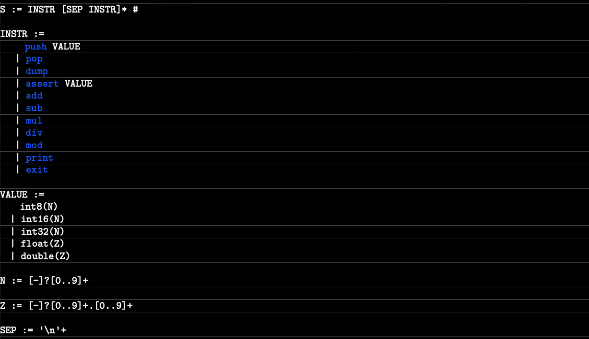

# Abstract VM (42 school)
Abstract VM is a machine that uses a stack to compute simple arithmetic expressions provided as basic assembly programs. 42 school C++ project made by **okryzhan**.

**Final mark:** 125/100 ✅ 

- [Abstract VM (42 school)](#abstract-vm-42-school)
	- [Usage](#usage)
	- [Documentation](#documentation)
		- [Instructions](#instructions)
		- [Values](#values)
		- [Grammar](#grammar)

## Usage
Compile all with  **make**.

> Execute from file:

```
./avm [filename]
```

> Execute from standard input (`;;` ends input):

```
./avm
```

> Play mode (standard input line-by-line):

```
./avm -p
```

## Documentation

### Instructions

|Lexeme| Description |
|:--|:--|
| push [value] | Pushes the value at the top of the stack. |
| pop | Unstacks the value from the top of the stack. If the stack is empty, the program execution stops with an error. |
| dump | Displays each value of the stack, from the most recent one to the oldest one WITHOUT CHANGING the stack. Each value is separated from the next one by a newline. |
| assert [value] | Asserts that the value at the top of the stack is equal to the one passed as parameter for this instruction. If it is not the case, the program execution stops with an error. |
| add | Unstacks the first two values on the stack, adds them together and stacks the result. If the number of values on the stack is strictly inferior to 2, the program execution must stop with an error. |
| sub | Unstacks the first two values on the stack, subtracts them, then stacks the result. If the number of values on the stack is strictly inferior to 2, the program execution must stop with an error.
| mul | Unstacks the first two values on the stack, multiplies them, then stacks the result. If the number of values on the stack is strictly inferior to 2, the program execution must stop with an error. |
| div | Unstacks the first two values on the stack, divides them, then stacks the result. If the number of values on the stack is strictly inferior to 2, the program execution must stop with an error. Moreover, if the divisor is equal to 0, the program execution must stop with an error too.
| ⭐️ div2 | Same as div, but if `6 div 5 equals to 1`, `6 div2 5 equals 1.2`.
| mod | Unstacks the first two values on the stack, calculates the modulus, then stacks the result. If the number of values on the stack is strictly inferior to 2, the program execution must stop with an error. Moreover, if the divisor is equal to 0, the program execution must stop with an error too. |
| print | Asserts that the value at the top of the stack is an 8-bit integer. Then interprets it as an ASCII value and displays the corresponding character on the standard output. |
| ⭐️ min | Displays min value in stack.
| ⭐️ max | Displays max value in stack.
| exit | Terminate the execution of the current program. If this instruction does not appears while all others instruction has been processed, the execution must stop with an error.
|;| A comment can be either at the start of a line, or after an instruction. Ends with newline.

### Values
- int8(n)
- int16(n)
- int32(n)
- float(z)
- double(z)

### Grammar

